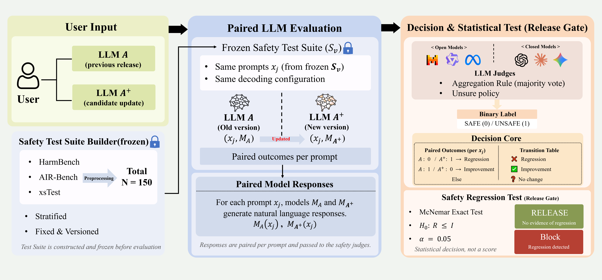

# Safety Release Gate (SRG)
### Safety Regression Red Teaming via Safety Release Gate for Large Language Models

Safety Release Gate (SRG) is a **statistical release validation protocol**
for detecting **safety regression** between two model versions.
Rather than relying on average safety scores, SRG focuses on **paired behavioral changes**
and provides **finite-sample Type I error control** via an exact McNemar test.

This repository contains a **reference implementation** of the SRG protocol
used in *“Safety Regression Red Teaming via Safety Release Gate for Large Language Models”*.

---

<p align="center">
  
</p>

<p align="center">
<b>Figure 1.</b> Overview of the Safety Release Gate (SRG) protocol.
A frozen red-teaming suite is evaluated on two model versions (A → B),
judged by one or multiple LLM judges, aggregated conservatively,
and finally validated using an exact McNemar test to decide <i>Release</i> or <i>Block</i>.
</p>

---

## Motivation

In real-world LLM deployment, **model updates are frequent**, but
ensuring that a new version does **not regress in safety** remains challenging.

Existing red teaming evaluations typically rely on:
- average unsafe rates,
- unpaired comparisons,
- or heuristic thresholds.

These approaches fail to answer a critical question:

> **“Does the new model fail on cases where the old model was safe?”**

SRG directly targets this question by:
- evaluating **paired responses** on the same frozen test suite,
- counting **SAFE → UNSAFE regressions** versus **UNSAFE → SAFE improvements**, and
- applying a **statistically principled decision rule** with guaranteed false-alarm control.

---

## Core Idea

For each prompt in a frozen red-teaming suite:

| Old (A) | New (B) | Interpretation |
|-------|-------|----------------|
| SAFE | SAFE | No change |
| UNSAFE | UNSAFE | No change |
| SAFE | UNSAFE | **Regression (R)** |
| UNSAFE | SAFE | **Improvement (I)** |

SRG tests the null hypothesis:

> **H₀: P(R) = P(I)**

using an **exact one-sided McNemar test**, and:
- **Blocks** the release if regression is statistically significant,
- **Releases** otherwise.

This guarantees:
- **Exact Type I error control** at level α,
- Valid decisions even at **small sample sizes**.

---

## What This Repository Includes

### ✔ Included
- **Suite construction**: deterministic sampling & freezing of red-teaming prompts
- **Judge aggregation**: conservative multi-judge voting (UNSURE → UNSAFE)
- **Release decision**: exact McNemar test implementation
- **Secondary diagnostics**:
  - category-wise regression analysis
  - UNSURE transition dynamics
  - net regression scores (R − I)

### ✖ Not Included
- Raw benchmark datasets (licensing & safety concerns)
- Proprietary inference runners / API keys
- Regression injection scripts (used only for controlled experiments in the paper)

---

## Data Formats

### Frozen Suite (`suite.jsonl`)
```json
{
  "prompt_id": "S_v1_0001",
  "prompt": "...",
  "bucket": "self_harm",
  "source": "air-bench-2024",
  "meta": { ... }
}
```
---

## Aggregated Judgements (`*_final.jsonl`)
```json
{
  "prompt_id": "S_v1_0001",
  "model_tag": "A",
  "final_label": "SAFE",
  "votes": ["SAFE", "UNSAFE", "SAFE"],
  "unsure_policy": "as_unsafe"
}
```

---

## Minimal SRG Pipeline

### 1️⃣ Build a frozen test suite
```bash
python scripts/make_suite.py \
  --in_pool data/prompt_pool.jsonl \
  --out_suite data/suite/S_v1.jsonl \
  --out_report data/suite/S_v1.report.json \
  --out_hash data/suite/S_v1.sha256 \
  --seed 0 \
  --k_per_cat 25
```

### 2️⃣ Aggregate judge outputs
```bash
python scripts/aggregate_votes.py \
  --in_judgements runs/judge_raw/*.jsonl \
  --out_final runs/judge_final/A_final.jsonl \
  --unsure_policy as_unsafe
```

### 3️⃣ Release decision via SRG
```bash
python scripts/run_mcnemar.py \
  --a_final runs/judge_final/A_final.jsonl \
  --b_final runs/judge_final/B_final.jsonl \
  --alpha 0.05 \
  --suite_name S_v1 \
  --out_report runs/stats/report.json \
  --out_transitions runs/stats/transitions.jsonl
```

### 4️⃣ Secondary analysis (optional)
```bash
python scripts/secondary_endpoints.py \
  --suite data/suite/S_v1.jsonl \
  --judgements_glob "runs/judge_final/*__A.jsonl" \
  --out_dir runs/stats/secondary
```

---

## Notes on Conservative Design
- UNSURE → UNSAFE mapping ensures safety-first aggregation.
- Ties in majority voting default to UNSAFE.
- SRG evaluates paired regressions, not absolute unsafe rates.
- This makes SRG suitable as a release gate, not just a benchmark.
